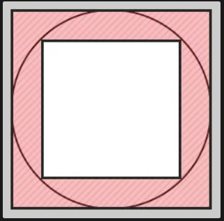

# JAVASCRIPT CƠ BẢN PHẦN 1

### Câu 01: Arithmetic (Toán tử số học)

Đề bài: Tính toán các phép tính sau và phỏng đoán kết quả của console.log().

```
var x = 5;
var y = 3;

// addition
console.log("x + y = ", x + y);

// subtraction
console.log("x - y = ", x - y);

// multiplication
console.log("x * y = ", x * y);

// division
console.log("x / y = ", x / y);

// remainder
console.log("x % y = ", x % y);

// increment
console.log("++x = ", ++x);
console.log("x++ = ", x++);
console.log("x = ", x);

// decrement
console.log("--x = ", --x);
console.log("x-- = ", x--);
console.log("x = ", x);

//exponentiation
console.log("x ** y =", x ** y);
```

### Câu 02: Comparison (Toán tử so sánh)

Đề bài: Tính toán các phép tính sau và phỏng đoán kết quả của console.log().

```
// equal operator
console.log(2 == 2);
console.log(2 == '2');

// not equal operator
console.log(3 != 2);
console.log('hello' != 'Hello');

// strict equal operator
console.log(2 === 2);
console.log(2 === '2');

// strict not equal operator
console.log(2 !== '2');
console.log(2 !== 2);
```

### Câu 03: Logical (Toán tử logic) 

Đề bài: Tính toán các phép tính sau và phỏng đoán kết quả của console.log().

```
// logical AND
console.log(true && true);
console.log(true && false);

// logical OR
console.log(true || false);

// logical NOT
console.log(!true);
```

### Câu 04: String operators (Nối chuỗi)

Đề bài: Tính toán các phép tính sau và phỏng đoán kết quả của console.log().

```
// logical AND
console.log("hello" + "world");

var a = "JavaScript";

a += " tutorial";
console.log(a);
```

### Câu 05: Swapping Variables (Hoán đổi biến)

Đề bài: Tính toán các phép tính sau và phỏng đoán kết quả của console.log().

```
// logical AND
var value1 = "one";
var value2 = "two";
```

### Câu 06: Một hình tròn và hai hình vuông

- Đề bài:
    - Hãy tưởng tượng một hình tròn nằm giữa và có hai hình vuông: một hình vuông nhỏ hơn và một hình vuông lớn hơn.
    
    - Đối với hình vuông nhỏ hơn, thì hình tròn là ngoại tiếp.
    
    - Đối với hình vuông lớn hơn, thì hình tròn là nội tiếp.

     
```
// logical AND
var value1 = "one";
var value2 = "two";
```