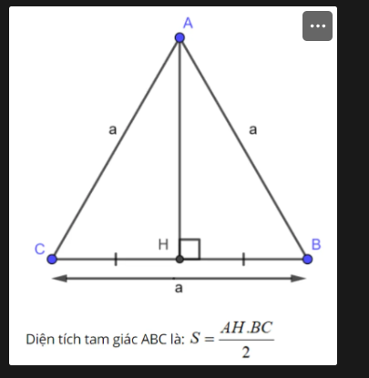

# JAVASCRIPT CƠ BẢN PHẦN 1

### Câu 01: Arithmetic (Toán tử số học)

Đề bài: Tính toán các phép tính sau và phỏng đoán kết quả của console.log().

```
var x = 5;
var y = 3;

// addition
console.log("x + y = ", x + y);

// subtraction
console.log("x - y = ", x - y);

// multiplication
console.log("x * y = ", x * y);

// division
console.log("x / y = ", x / y);

// remainder
console.log("x % y = ", x % y);

// increment
console.log("++x = ", ++x);
console.log("x++ = ", x++);
console.log("x = ", x);

// decrement
console.log("--x = ", --x);
console.log("x-- = ", x--);
console.log("x = ", x);

//exponentiation
console.log("x ** y =", x ** y);
```

### Câu 02: Comparison (Toán tử so sánh)

Đề bài: Tính toán các phép tính sau và phỏng đoán kết quả của console.log().

```
// equal operator
console.log(2 == 2);
console.log(2 == '2');

// not equal operator
console.log(3 != 2);
console.log('hello' != 'Hello');

// strict equal operator
console.log(2 === 2);
console.log(2 === '2');

// strict not equal operator
console.log(2 !== '2');
console.log(2 !== 2);
```

### Câu 03: Logical (Toán tử logic) 

Đề bài: Tính toán các phép tính sau và phỏng đoán kết quả của console.log().

```
// logical AND
console.log(true && true);
console.log(true && false);

// logical OR
console.log(true || false);

// logical NOT
console.log(!true);
```

### Câu 04: String operators (Nối chuỗi)

Đề bài: Tính toán các phép tính sau và phỏng đoán kết quả của console.log().

```
// logical AND
console.log("hello" + "world");

var a = "JavaScript";

a += " tutorial";
console.log(a);
```

### Câu 05: Swapping Variables (Hoán đổi biến)

Đề bài: Tính toán các phép tính sau và phỏng đoán kết quả của console.log().

```
// logical AND
var value1 = "one";
var value2 = "two";
```

### Câu 06: Một hình tròn và hai hình vuông

- Đề bài:
    - Hãy tưởng tượng một hình tròn nằm giữa và có hai hình vuông: một hình vuông nhỏ hơn và một hình vuông lớn hơn.
    
    - Đối với hình vuông nhỏ hơn, thì hình tròn là ngoại tiếp.
    
    - Đối với hình vuông lớn hơn, thì hình tròn là nội tiếp.

     
```
// logical AND
var value1 = "one";
var value2 = "two";
```
- Đáp án:
    - Giả sử:
        - Svt: Diện tích hình vuông to
        - Svn: Diện tích hình vuông nhỏ
    - Ta có:
        - Diện tích hình vuông to: Svt = 2R * 2R = 4R^2

             
            
        - Diện tích hình vuông nhỏ: Svn = 2 * (1/2 * R * 2R) = 2R^2
            
             
            
    - Vậy:
        - S = Svt - Svn = 4R^2 - 2R^2 = 2R^2

### Câu 07: Kiểm tra xem một chuỗi có phải là palindrome hay không?

Đề bài: Palindrome là từ khi đọc ngược cũng như đọc xuôi.

Ví dụ:
```
palindrome("cicic") --> true

palindrome("solos") --> true

palindrome("test") --> false

palindrome("hello") --> false

palindrome("rotavator") --> true
```

### Câu 08: Data Types (Kiểu dữ liệu)

Đề bài: Phỏng đoán kết quả của console.log().

```
console.log(typeof "Le Van A");
console.log(typeof 5000);
console.log(typeof 5000.99);
console.log(typeof [10, 15, 17]);
console.log(typeof { name: "Le Van A", age: 18, country: "Viet Nam" });
console.log(typeof true);
console.log(typeof false);
console.log(typeof undefined);
console.log(typeof null);
```

### Câu 09: Template Literals (Template Strings)

Đề bài: Phỏng đoán kết quả của console.log(), sau đó code lại để thành thạo (Sau sẽ dùng nhiều).    

```
var img = "https://cdn.daca.vn/media/blog/lap-trinh/js%20tips%20-%20m%E1%BB%99t%20s%E1%BB%91%20c%C3%A1ch%20vi%E1%BA%BFt%20js%20ng%E1%BA%AFn%20g%E1%BB%8Dn%20h%C6%A1n.png";
var title = "JS TIPS - Một số cách viết JS ngắn gọn hơn";
var desc = "Hôm nay Daca.vn gửi tới các bạn một số những tips để giúp bạn code JS một cách hiệu quả...";
var url = "https://daca.vn/js-tips-mot-so-cach-viet-js-ngan-gon-hon";

var string = `
  <div class="article">
    <a href="${url}">
        <div class="inner-image">
            
        </div>
        <div class="inner-content">
            <h2 class="inner-title">${title}</h2>
            <p class="inner-desc">${desc}</p>
        </div>
    </a>
  </div>
`;

console.log(string);
```

### Câu 10: Type Coercion (Ép kiểu)

Đề bài: Phỏng đoán kết quả của console.log().   

```
var a = "100";
var b = 20;
var c = true;

console.log(+a + b + c);
```

### Câu 11: Assignment Operators (Toán tử gán)

Đề bài: Phỏng đoán kết quả của console.log(). 

```
var a = 10;

a = a + 20;
console.log(a);

a = a + 70;
console.log(a);

a += 100;
console.log(a);

a -= 50;
console.log(a);

a /= 50;
console.log(a);
```

### Câu 12: Operators Challenges

Đề bài: Phỏng đoán kết quả của console.log().

```
var a = 10;
var b = "20";
var c = 80;

var test1 = ++a + +b++ + +c++ - +a++;
console.log(test1);
console.log(a, b, c);
console.log("------------");

var test2 = ++a + -b + +c++ - -a++ + +a;
console.log(test2);
console.log(a, b, c);
console.log("------------");

var test3 = --c + +b + --a * +b++ - +b * a + --a - +true;
console.log(test3);
console.log(a, b, c);
console.log("------------");
```

### Câu 13: Math Object

- Đề bài:
    - Tìm hiểu thêm một số hàm toán học sau:
        - round() => Làm tròn lên hoặc xuống.
        - ceil() => Làm tròn lên.
        - floor() => Làm tròn xuống.
        - min() => Lấy số nhỏ nhất.
        - max() => Lấy số lớn nhất.
        - pow() => Lũy thừa.
        - random() => Tạo số thập phân ngẫu nhiên từ 0 đến 1.
        - trunc() => Xóa số thập phân.
    - Phỏng đoán kết quả của console.log().

```
console.log(Math.round(99.2));

console.log(Math.round(99.5));

console.log(Math.ceil(99.2));

console.log(Math.floor(99.9));

console.log(Math.min(10, 20, 100, -100, 90));

console.log(Math.max(10, 20, 100, -100, 90));

console.log(Math.pow(2, 4));

console.log(Math.random());

console.log(Math.trunc(99.5));
```

### Câu 14: String Methods (1)

Đề bài: Phỏng đoán kết quả của console.log().

```
var theName = "  28Tech  ";

console.log(theName);
console.log(theName[1]);
console.log(theName[5]);

console.log(theName.charAt(1));
console.log(theName.charAt(5));

console.log(theName.length);

console.log(theName.trim());

console.log(theName.toUpperCase());
console.log(theName.toLowerCase());

console.log(theName.trim().charAt(5).toUpperCase());
```

### Câu 15: String Methods (2)

Đề bài: Phỏng đoán kết quả của console.log().

```
var a = "Daca.vn - Professional Web Design Services.";

console.log(a.indexOf("Web"));
console.log(a.indexOf("Web", 24));
console.log(a.indexOf("vn"));

console.log(a.lastIndexOf("Design"));

console.log(a.slice(10, 22));
console.log(a.slice(-16, -10));

console.log(a.split("", 7));
```

### Câu 16: Comparison Operators (Toán tử so sánh)

Đề bài: Phỏng đoán kết quả của console.log().

```
console.log(10 == "10");
console.log(-100 == "-100");
console.log(10 != "10");

console.log(10 === "10");
console.log(10 !== "10");
console.log(10 !== 10);

console.log(10 > 20);
console.log(10 > 10);
console.log(10 >= 10);

console.log(10 < 20);
console.log(10 < 10);
console.log(10 <= 10);

console.log(typeof "Daca.vn" === typeof "Nam Dang");
```

### Câu 17: Logical Operators (Toán tử logic)

Đề bài: Phỏng đoán kết quả của console.log().

```
console.log(true);

console.log(!true);

console.log(!(10 == "10"));

console.log((10 == "10") && (10 > 8) && (10 > 50));

console.log((10 == "10") || (10 > 80) || (10 > 50));
```

### Câu 18: Add And Remove From Array

Đề bài: Phỏng đoán kết quả của console.log().

**Ví dụ 1:**
```
const myFriends = ["Le Van A", "Nguyen Thi B", "Do Van C", "Dao Thi D"];

myFriends.unshift("Vu Van E", "Nguyen Van F");
console.log(myFriends);
```
**Ví dụ 2:**
```
const myFriends = ["Le Van A", "Nguyen Thi B", "Do Van C", "Dao Thi D"];

myFriends.push("Vu Van E", "Nguyen Van F");
console.log(myFriends);
```

**Ví dụ 3:**
```
const myFriends = ["Le Van A", "Nguyen Thi B", "Do Van C", "Dao Thi D"];

myFriends.push("Vu Van E", "Nguyen Van F");
console.log(myFriends);
```

**Ví dụ 4:**
```
const myFriends = ["Le Van A", "Nguyen Thi B", "Do Van C", "Dao Thi D"];

myFriends.pop();
console.log(myFriends);
```

### Câu 19: indexOf() và lastIndexOf()

Đề bài: Viết một chương trình JavaScript để tìm vị trí đầu tiên và vị trí cuối cùng của một từ trong một chuỗi.

```
var chuoi = "JavaScript là một ngôn ngữ lập trình phổ biến. Đây là ngôn ngữ đứng đầu trong bảng xếp hạng 2023.";
var tuTimKiem = "ngôn ngữ";
```

### Câu 20: Chuyển Đổi Phút thành Giây

Đề bài: Viết một hàm nhận một số phút và chuyển đổi nó thành giây.

**Ví dụ:**
```
convert(5) ➞ 300

convert(3) ➞ 180

convert(2) ➞ 120
```

### Câu 21: Diện Tích của Tam Giác

Đề bài: Viết một hàm nhận vào độ dài cơ sở và chiều cao của một tam giác và trả về diện tích của nó.



**Ví dụ:**
```
triArea(3, 2) ➞ 3

triArea(7, 4) ➞ 14

triArea(10, 10) ➞ 50
```

### Câu 22: Cạnh Lớn Nhất của Tam Giác

Đề bài: Viết một hàm tìm phạm vi lớn nhất của cạnh thứ ba của một tam giác, trong đó độ dài các cạnh đều là số nguyên.

**Ví dụ:**
```
nextEdge(8, 10) ➞ 17

nextEdge(5, 7) ➞ 11

nextEdge(9, 2) ➞ 10
```
**Lưu ý:**
```
    - (cạnh1 + cạnh2) - 1 = phạm vi lớn nhất của cạnh thứ ba.
    - Độ dài các cạnh của tam giác là số nguyên dương.
```

### Câu 23: Tổng Góc của Đa Giác

Đề bài: Cho một đa giác đều có n cạnh, trả về tổng các góc của đa giác (tính bằng độ).

**Ví dụ:**
```
sumPolygon(3) ➞ 180

sumPolygon(4) ➞ 360

sumPolygon(6) ➞ 720
```
**Lưu ý:**
```
    - n luôn lớn hơn 2.
    - Công thức (n−2)×180 cho tổng của tất cả các góc của một đa giác n cạnh.
```

### Câu 24: Điểm Bóng Đá

- Đề bài:
    - Tạo một hàm nhận số lượng chiến thắng, hòa và thất bại và tính toán số điểm mà một đội bóng đã đạt được.

        - Chiến thắng được 3 điểm.
        - Hòa được 1 điểm.
        - Thất bại không được điểm nào.

**Ví dụ:**
```
footballPoints(3, 4, 2) ➞ 13
// Theo thứ tự thắng, hòa, thua

footballPoints(5, 0, 2) ➞ 15

footballPoints(0, 0, 1) ➞ 0
```

### Câu 25: Khung Hình Trên Giây

- Đề bài:
    - Tạo một hàm trả về số khung hình được hiển thị trong một số phút nhất định cho một FPS (khung hình/giây) cụ thể.

**Ví dụ:**
```
frames(1, 1) ➞ 60
// 1 là số phút, 1 là số khung hình/giây

frames(10, 1) ➞ 600
// 10 là số phút, 1 là số khung hình/giây

frames(10, 25) ➞ 15000
// 10 là số phút, 25 là số khung hình/giây
```

### Câu 26: Diện tích hình chữ nhật

- Đề bài: Tạo một hàm tính diện tích của hình chữ nhật. Nếu các đối số không hợp lệ, hàm phải trả về -1.

**Ví dụ:**
```
area(3, 4) ➞ 12

area(10, 11) ➞ 110

area(-1, 5) ➞ -1

area(0, 2) ➞ -1
```

### Câu 27: Number of Stickers (Số lượng nhãn dán)

- Đề bài:
    - Cho một khối Rubik có độ dài cạnh là n, trả về số lượng sticker (nhãn dán) đơn lẻ cần thiết để phủ toàn bộ khối.

        - Khối Rubik có cạnh dài 1 có 6 miếng dán.
        - Khối Rubik có cạnh dài 2 có 24 miếng dán.
        - Khối Rubik có cạnh dài 3 có 54 miếng dán.

        
**Ví dụ:**
```
howManyStickers(1) ➞ 6

howManyStickers(2) ➞ 24

howManyStickers(3) ➞ 54
```

**Ghi chú**
```
    - Một khối Rubik có 6 mặt.
    - Mỗi mặt có n * n nhãn dán.
```

